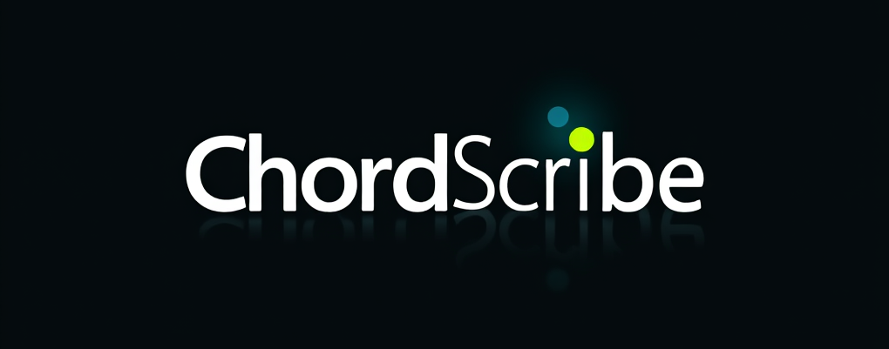

# ChordScribe



**ChordScribe** is an open-source tool that transcribes chords from audio files in real-time (or near real-time). Whether you're a musician trying to learn a song by ear, a songwriter capturing inspiration, or a developer interested in audio processing, ChordScribe is here to help. It detects basic major and minor chords and outputs them with timestamps.

This project is a starting point—contributions are welcome to make it more accurate, feature-rich, and user-friendly!

## Features
- **Chord Detection**: Identifies basic major and minor chords from audio files.
- **Timestamped Output**: Provides chords with corresponding time markers.
- **Lightweight & Offline**: Runs locally with no internet required.
- **Extensible**: Built with Python and `librosa`, ready for enhancements like real-time mic input or a GUI.

## Demo
Example output for a sample audio file:
```
Time: 0.23s - Chord: C
Time: 0.69s - Chord: G
Time: 1.15s - Chord: Am
Time: 1.61s - Chord: F
```

## Installation

### Prerequisites
- Python 3.7+
- [FFmpeg](https://ffmpeg.org/download.html) (for audio file support)

### Steps
1. Clone the repository:
   ```bash
   git clone https://github.com/frangedev/chordscribe.git
   cd chordscribe
   ```
2. Install dependencies:
   ```bash
   pip install -r requirements.txt
   ```
3. (Optional) Install FFmpeg:
   - macOS: `brew install ffmpeg`
   - Ubuntu: `sudo apt-get install ffmpeg`
   - Windows: Download from [FFmpeg site](https://ffmpeg.org/download.html) and add to PATH.

4. Run the script:
   ```bash
   python chordscribe.py path/to/your/audiofile.mp3
   ```

## Usage
```bash
python chordscribe.py <audio_file>
```
- Supported formats: `.mp3`, `.wav`, etc. (via FFmpeg).
- Output: A list of detected chords with timestamps printed to the console.

## How It Works
- Uses `librosa` to compute a chromagram (pitch class profile) from audio.
- Detects beats to segment the audio into chunks.
- Estimates chords using a simple heuristic based on major/minor templates.

**Note**: Current detection is basic (major/minor chords only). Accuracy can be improved with contributions!

## Contributing
We’d love your help to make ChordScribe better! Here are some ideas:
- Add real-time microphone input (e.g., with `pyaudio`).
- Build a GUI (e.g., with `PyQt` or `Tkinter`).
- Improve chord detection (e.g., support 7ths, inversions, or use machine learning).
- Add export options (e.g., MIDI, PDF).

### How to Contribute
1. Fork the repo.
2. Create a branch: `git checkout -b feature/your-idea`.
3. Commit changes: `git commit -m "Add your feature"`.
4. Push to your fork: `git push origin feature/your-idea`.
5. Open a pull request!

## Roadmap
- [ ] Real-time audio input from microphone.
- [ ] Graphical interface for chord visualization.
- [ ] Support for complex chords (7ths, diminished, etc.).
- [ ] Export to MIDI or sheet music formats.

## Limitations
- Only detects basic major/minor chords for now.
- No real-time mic support yet (file-based only).
- Accuracy depends on audio quality and complexity.

## License
This project is licensed under the [MIT License](LICENSE).

## Acknowledgments
- Built with [librosa](https://librosa.org/) for audio analysis.
- Inspired by musicians who’ve struggled to figure out chords by ear!

## Contact
Questions? Ideas? Open an issue or reach out on [X](https://x.com/FRANGEinIST)!

---

Happy coding, and enjoy transcribing those chords!
